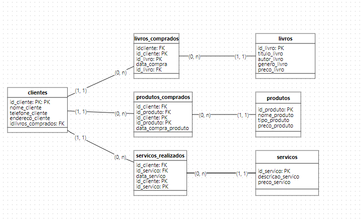
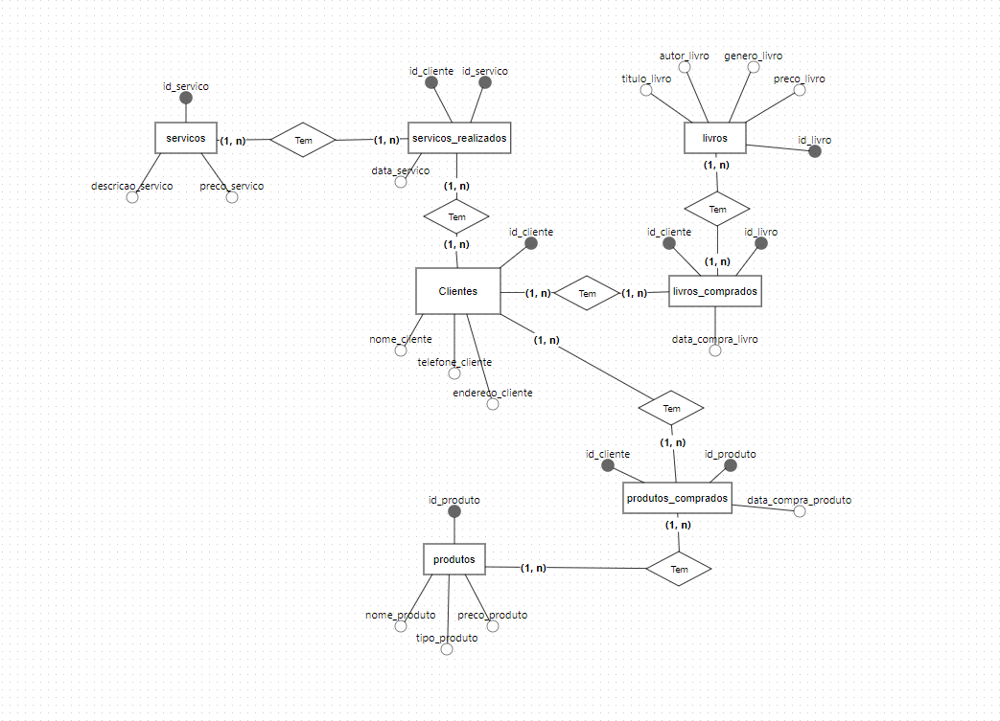

# Banco de Dados - Cafelivraria Tech

Este repositório apresenta a evolução de um banco de dados para uma livraria que também oferece produtos e serviços complementares. Ele inclui:

- **Um modelo desnormalizado inicial:** Todos os dados armazenados em uma única tabela.
- **O processo de normalização:** Separação dos dados em tabelas organizadas e relacionadas.
- **Um modelo normalizado final:** Melhor organização e flexibilidade do banco de dados.

---

## Estrutura do Repositório

- **`SQLQuery1.sql`**  
  O script SQL consolidado contendo:
  - Criação do banco de dados.
  - Modelo desnormalizado.
  - Modelo físico normalizado.
  - Inserção de dados e funcionalidades avançadas.

- **`livraria_cafe_tech_logico.png`**  
  Diagrama lógico representando as entidades, relações e chaves.

- **`livraria_cafe_tech_conceitual.png`**  
  Diagrama conceitual destacando as conexões entre as entidades e atributos principais.

- **`GuiaInstalacao.md`**  
  Passo a passo para configurar o ambiente SQL Server e executar o script.

---

## Diagramas

### **Diagrama Lógico**

O diagrama lógico detalha as tabelas, colunas e relacionamentos entre elas no modelo normalizado.

---

### **Diagrama Conceitual**

O diagrama conceitual apresenta uma visão de alto nível do banco de dados, destacando as entidades principais e suas associações.

---

## Como Utilizar

1. **Instale o SQL Server e o SSMS**  
   Consulte o [Guia de Instalação](GuiaInstalacao.md) para preparar o ambiente.

2. **Abra o Script SQL**  
   - Localize o arquivo `SQLQuery1.sql`.
   - Abra-o no SQL Server Management Studio (SSMS).

3. **Execute o Script**  
   - O script é organizado em seções. Execute cada uma para:
     - Criar o banco de dados.
     - Criar as tabelas desnormalizadas e normalizadas.
     - Inserir dados e explorar consultas.

4. **Compare os Modelos**  
   - Avalie a evolução do modelo desnormalizado para o normalizado, com base nos diagramas e no script SQL.

5. **Teste as Funcionalidades**  
   - Use as views, procedures e triggers incluídas para verificar o comportamento do banco.

---

## Documentação Adicional

- [Guia de Instalação](GuiaInstalacao.md)
- [Diagrama Lógico](livraria_cafe_tech_logico.png)
- [Diagrama Conceitual](livraria_cafe_tech_conceitual.png)
